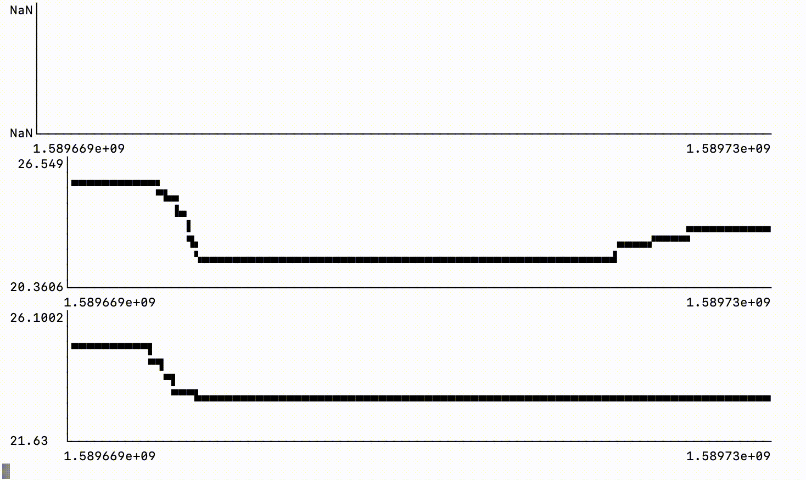
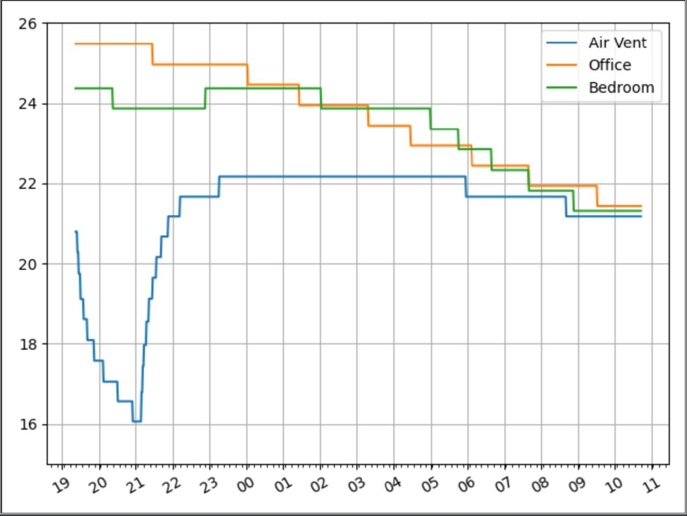

# Collect
Get all the push events from a mozilla iot gateway:

```
export JWT='ACCESS_TOKEN_GOES_HERE'
export IOT_GATEWAY='wss://steelcomputers.mozilla-iot.org/things?jwt='"$JWT"
parseMsg() { jq '. + {"timespamp": (now * 100.0) | (floor / 100.0)}' -c ; }
websocat --unidirectional --text $IOT_GATEWAY - | parseMsg | pv | tee -a eventlog.json
```

# Parse

```
jq --slurp --raw-output --from-file ~/jq/format_moz_1.jq < eventlog.json
```

# Graph

## Microsoft Excel
I tried making graphs with excel, had it automagically pulling data from a csv,
but it didn't seem that good. It wasn't easy to do scatter or time series using
a unix timestamp. I made a formula to parse unix dates but even that didn't work
very well. It broke every time I updated the soruce data.

## jp - Dead simple terminal plots
https://github.com/sgreben/jp


Pretty nice job, but I [can't specify the min/max for x or y](https://github.com/sgreben/jp/issues/24).
Also I think you are only able to plot one thing at a time. If I could define
the x/y min/max I think I could draw multiple times with different colours.
Also found a bug where it couldn't draw a horizontal line. So if the time period
I want to graph doesn't have a change in temperature, it gives NaN for the y
axis.

## matplotlib - Python Graphing
https://matplotlib.org/



It's doing pretty well but takes a bit more to learn. Pretty graphs and even
animation. Just need to finish making a tool that will graph using data from
standard in so I can pipe to it.
